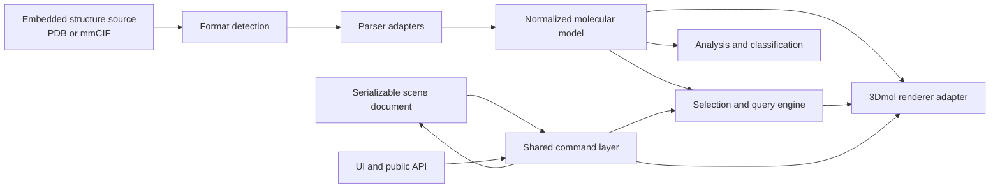

# Molecular Data Model and Document Architecture Plan

## Decision summary

mol.html should use a custom runtime molecular model built around PDBx/mmCIF concepts while retaining the original PDB or mmCIF text as the canonical embedded structure source.

The runtime model should be derived, replaceable, and excluded from the serialized `.mol.html` document. This follows the general architecture of mature molecular viewers such as ChimeraX, PyMOL, and Mol*: standards define source identities and exchange formats, while application-specific models support efficient interaction, selection, analysis, and rendering.

This plan preserves the project's defining constraints:

- One self-contained, offline-capable HTML artifact.
- Existing version 1 documents remain readable.
- PDB and mmCIF eventually provide the same user experience.
- 3Dmol remains the renderer initially.
- Original source data and unknown document fields are preserved.
- The generated artifact remains deterministic and within an explicitly approved size budget.
- All implementation work is performed on a new dedicated feature branch rather than directly on the default branch.
- The completed implementation is delivered for review through a pull request.

## Implementation status

Phases 0 through 5 and the final integration work are implemented on
`feature/normalized-molecular-model`. The result includes the normalized PDB/mmCIF model,
source-identity selectors, validated versioned schemas and migration, the renderer boundary,
format-neutral UI and browser APIs, explicit base-instance/operator assembly records, lazy
spatial indexes, a shared document-command boundary, and regression fixtures. MolViewSpec,
BinaryCIF, and richer Chemical Component Dictionary integration remain the explicitly deferred
Phase 6 scope.

The final deterministic artifact is 928,869 bytes, leaving 21,131 bytes under the existing
950,000-byte ceiling. Model/schema checks, 67 artifact invariants, all 27 Chromium regression
tests, and the scheduled 5,000-atom performance case pass. Publication is performed from the
dedicated branch through a review-ready pull request; merging is intentionally outside this
plan's implementation step.

## Target architecture



The most important boundary is between the normalized molecular model and the renderer adapter. Application features should consume the normalized model rather than 3Dmol's private atom representation.

## 1. Normalized molecular model

The core should expose a format-independent structure similar to:

```js
NormalizedStructure {
  source,
  topology: {
    atoms,
    residues,
    instances,
    entities,
    bonds
  },
  coordinateSets,
  assemblies,
  classifications,
  indexes
}
```

The model should distinguish these concepts:

- **Entity:** a chemically distinct molecule or polymer sequence.
- **Instance:** one occurrence of an entity in the asymmetric unit.
- **Residue:** a polymer residue, ligand, ion, or solvent residue.
- **Atom:** one atomic site.
- **Assembly instance:** a molecular instance combined with a biological-assembly transform.
- **Connected component:** a derived bond-connected group, not a substitute for entity or instance.

This separation addresses structures such as 7RIL, where a chain identifier, a molecular instance, a chemical identity, and a functional role are not equivalent.

### Runtime storage

The initial implementation can use ordinary arrays and maps for maintainability, but consumers should access them through stable interfaces and dense runtime IDs such as:

```text
AtomIndex
ResidueIndex
InstanceIndex
EntityIndex
```

Consumers must not depend on whether the underlying data is stored as JavaScript objects or columnar arrays. This permits a future compact or vectorized representation without requiring another application-wide rewrite.

Dense runtime indexes must never be persisted in a document.

## 2. Molecular identity

Use mmCIF identity as the common vocabulary even when the source is PDB. Each atom should preserve as many of the following fields as the source provides:

```js
{
  modelNumber,

  atomSiteId,

  labelEntityId,
  labelAsymId,
  labelSeqId,
  labelCompId,
  labelAtomId,
  labelAltId,

  authAsymId,
  authSeqId,
  authCompId,
  authAtomId,

  insertionCode,
  pdbSerial
}
```

Identity rules:

- `label_*` identifiers are preferred for machine matching.
- `auth_*` identifiers are preserved for familiar display and scientific communication.
- PDB serials and record identifiers are retained as source information.
- Concepts missing from a PDB file are synthesized deterministically and marked as inferred.
- Normalization never destroys the original source values.

For PDB input, the parser should construct deterministic entity and instance IDs from chains, residues, connectivity, sequences, and record types. These inferred identities should carry provenance such as `pdb-inferred` rather than being presented as values supplied by mmCIF.

## 3. Parser boundary

Define a narrow parser interface:

```js
parseStructure(source) => {
  normalizedStructure,
  diagnostics
}
```

The first two adapters should be:

- `PdbParserAdapter`, wrapping and gradually improving the existing PDB parser.
- `MmcifParserAdapter`, producing the same normalized model from textual mmCIF.

Before selecting the mmCIF implementation, conduct a bounded technical spike comparing:

1. Reusing the parser bundled with 3Dmol.
2. Implementing a small category-preserving mmCIF parser.
3. Selectively bundling an established parser such as Mol*'s CIF reader.

Evaluate each choice against:

- Preservation of both `label_*` and `auth_*` identities.
- Access to entity, sequence, assembly, bond, and chemical-component categories.
- Useful diagnostics for malformed files.
- Freedom from private renderer state or unstable internal APIs.
- Browser, local-file, and offline compatibility.
- Increase in generated artifact size.
- License compatibility.

Do not assume that 3Dmol's reader is sufficient for the domain model merely because it can render mmCIF. A display-oriented parser may discard categories that the application needs. Confirm this with a prototype and representative fixtures.

Text mmCIF should be implemented first. BinaryCIF can be considered later as an input and size optimization.

## 4. Selection system

Persistent selectors and runtime selection results should be separate.

A saved selector should describe intent using stable source identity:

```js
{
  kind: "atom",
  structureId: "structure-1",
  sourceIdentity: {
    modelNumber: 1,
    atomSiteId: "317",
    labelAsymId: "D",
    labelSeqId: null,
    labelCompId: "PIP",
    labelAtomId: "C1",
    authAsymId: "B",
    authSeqId: 401
  }
}
```

At runtime, a selector resolves to a compact set of dense atom or residue indexes. Resolution priority should be:

1. `atomSiteId` within the same source and model.
2. Complete `label_*` identity.
3. `auth_*` identity combined with atom, residue, and model information.
4. PDB serial or migrated legacy identity.
5. An explicit unresolved result rather than silently selecting the wrong atom.

Provide distinct selector concepts for:

- Atom
- Residue
- Molecular instance
- Entity
- Connected component
- Functional role
- Declarative query

Do not overload `chain` to represent all of these concepts.

## 5. Coloring and classification

Keep "color by chain" literal and predictable, then add separate modes:

- By author chain
- By molecular instance
- By entity or polymer identity
- By functional role

Classification should be structured and explainable:

```js
{
  role: "polymer" | "ligand" | "ion" | "solvent" | "unknown",
  subtype: "protein" | "dna" | "rna" | "...",
  provenance: "mmcif-entity" | "ccd" | "pdb-record"
            | "connectivity-heuristic" | "name-fallback"
            | "unknown"
}
```

This prevents heuristics from being mistaken for source facts and lets the UI explain uncertain classifications.

For 7RIL, the required behavior is:

- PIP remains in author chain B if that is what the source reports.
- PIP has a molecular instance and entity distinct from the nucleic acid.
- "By author chain" may intentionally give both the same color.
- "By molecular instance", "by entity", and "by role" distinguish them.

## 6. Renderer integration

Keep 3Dmol initially, behind a renderer adapter.

The adapter should:

- Load the original PDB or mmCIF source.
- Maintain a verified mapping between normalized atom indexes and renderer atoms.
- Translate normalized selection results into 3Dmol selections.
- Translate scene representations into renderer operations.
- Translate picking results back into canonical atom identities.
- Contain all 3Dmol-specific behavior and workarounds.

During migration, the domain parser and 3Dmol may both parse the structure. Cross-parser tests must verify that atom identity and coordinate mapping remain one-to-one. A single parse path may be pursued later if it remains practical and does not couple the domain model to the renderer.

Camera, representation, and user scene state remain separate from molecular topology.

## 7. Document format and migration

Do not serialize `NormalizedStructure` into the HTML document. Continue storing:

- The original structure source.
- Source format and provenance.
- Serializable scene intent.
- Saved selectors, measurements, views, annotations, and settings.

Introduce a formal document-loading pipeline:

```text
parse document
-> validate version
-> preserve unknown fields
-> migrate logical representation
-> build normalized runtime model
-> resolve scene state
```

Recommended version behavior:

- Existing version 1 documents continue to open unchanged.
- An untouched v1 document can remain v1 when saved.
- Using mmCIF or identity-aware v2 features upgrades the document to v2.
- Migrated legacy selectors retain their original chain semantics.
- Application version, public API version, and document schema version remain independent.

Each document version should have a JSON Schema, migration fixtures, deterministic-output tests, and round-trip tests. Unknown fields should be preserved wherever possible so that an older application does not silently destroy data added by a newer one.

## 8. Shared command layer

UI actions and the public API should issue the same commands, for example:

```text
Select
SetRepresentation
SetColorMode
CreateMeasurement
SaveSelection
SetCamera
```

Commands update serializable document state. Derived molecular indexes, selection caches, and renderer caches do not belong in the document or undo history.

This provides a common implementation point for:

- Revision handling
- Undo and redo
- Dirty-state tracking
- Autosave
- Public API validation
- Future scripting or collaboration

It also provides a controlled way to split the responsibilities currently concentrated in `src/app.js`.

## Branch and pull request workflow

Before Phase 0 begins, create a new feature branch from the current approved base of the default branch. A suitable branch name would be `feature/normalized-molecular-model`, although the exact name can follow the repository's established convention.

All work described by this plan must remain on that branch until review. Do not commit implementation changes directly to the default branch.

Development on the feature branch should follow these rules:

- Keep commits focused on one architectural step, migration, or testable behavior.
- Add or update tests in the same commit as the behavior they verify.
- Preserve unrelated user changes and exclude unrelated files from commits.
- Keep the branch buildable and the existing test suite passing at phase boundaries.
- Record major design decisions and deviations from this plan in the repository rather than leaving them only in commit messages.
- Re-run compatibility, deterministic-build, legal, artifact-size, and browser tests before opening the pull request.

Open the pull request only after the agreed implementation scope is complete and all required completion gates pass. Phase 6 contains optional interchange extensions; before development begins, decide whether they belong in this pull request or will be separate follow-up work. Excluded optional items should be documented in the pull request rather than partially implemented.

The final pull request should include:

- A concise architecture and user-visible behavior summary.
- The parser decision and supporting artifact-size or performance measurements.
- Document schema and migration notes.
- Compatibility results for existing v1 documents.
- PDB/mmCIF fixture and cross-format test results.
- Before-and-after artifact-size measurements.
- Any known limitations, deferred items, or ambiguous molecular cases.
- UI screenshots or short demonstrations for user-visible workflow changes where useful.
- A reviewer guide identifying the model, parser, persistence, renderer-adapter, and migration boundaries.

## Rollout plan

### Phase 0: architecture and parser spike

Deliverables:

- Write the domain-model and molecular-identity architecture decision record.
- Evaluate the three mmCIF parser strategies.
- Establish representative molecular fixtures.
- Measure artifact-size and performance impact.
- Specify model invariants and identity-resolution rules.

Exit criteria:

- The parser choice is supported by a working prototype and measurements.
- Identity rules and format-to-model mappings are documented.
- No product behavior or persisted document format has changed.

### Phase 1: normalized PDB model

Deliverables:

- Introduce parser and normalized-model interfaces.
- Adapt the existing PDB parser.
- Move existing selection and analysis consumers onto the normalized model.
- Keep current behavior and document format unchanged.

Exit criteria:

- All existing tests pass.
- Existing documents render and behave identically.
- No application feature outside the renderer adapter depends on 3Dmol atom objects.

### Phase 2: identity-aware selections

Deliverables:

- Add entity, instance, residue, atom, and role selectors.
- Implement runtime selector resolution and indexes.
- Add author-chain, instance, entity, and role coloring.
- Migrate legacy selectors in memory.

Exit criteria:

- 7RIL and other ambiguous-chain fixtures behave correctly.
- Legacy chain behavior remains available and predictable.
- Saved selectors either resolve deterministically or report an explicit failure.

### Phase 3: document version 2

Deliverables:

- Define and validate the v2 schema.
- Implement feature-gated v1-to-v2 migration.
- Preserve unknown document fields.
- Document the agent-editable selector representation.

Exit criteria:

- V1 documents round-trip safely.
- V2 identities and selectors survive save, reload, and deterministic rebuild.
- The legal block and single-file integrity checks still pass.

### Phase 4: textual mmCIF support

Deliverables:

- Add textual mmCIF parsing.
- Support local opening, fetching, persistence, and rendering.
- Map entities, instances, assemblies, bonds, and metadata.
- Give PDB and mmCIF the same UI workflow.

Exit criteria:

- Paired PDB and mmCIF versions of the same entry produce equivalent normalized structures wherever the formats contain equivalent information.
- A saved mmCIF document is completely offline and self-contained.
- Picking, selections, coloring, measurements, and views work for both formats.

### Phase 5: assemblies and performance

Deliverables:

- Represent assembly transforms without duplicating base topology.
- Add lazy spatial indexes and large-structure safeguards.
- Move parsing or expensive analysis to an inline worker only if profiling justifies it.
- Establish explicit parsing, interaction, memory, and artifact-size budgets.

Exit criteria:

- Representative large structures remain responsive within the agreed budgets.
- Assembly instances preserve their relationship to the base molecular instance and source operator.
- The worker path, if introduced, works in local offline HTML without relying on a server.

### Phase 6: interchange extensions

Potential deliverables:

- Support a documented subset of MolViewSpec import and export.
- Add BinaryCIF input if it provides a worthwhile size or loading benefit.
- Add richer Chemical Component Dictionary integration.

These extensions should not block the core model or textual mmCIF support.

### Final phase: integration verification and pull request

Deliverables:

- Reconcile the completed implementation with this plan and document intentional deviations.
- Run the complete unit, integration, browser, migration, deterministic-build, legal, and artifact-integrity test suites.
- Review the feature-branch diff for unrelated changes, accidentally serialized runtime data, generated-file drift, and undocumented schema changes.
- Confirm that the branch contains all required documentation and migration fixtures.
- Push the dedicated feature branch and open a pull request against the repository's default branch.
- Populate the pull request with the evidence and reviewer guide defined in the branch and pull request workflow.

Exit criteria:

- The feature branch is published without rewriting or directly modifying the default branch.
- All required checks pass, or any external CI limitation is clearly identified in the pull request.
- The pull request contains the complete agreed scope and no knowingly partial optional feature.
- The pull request is ready for human review; merging remains a separate reviewer or maintainer decision.

## Test strategy

### Required fixtures

The fixture set should include:

- 7RIL and its PIP identity issue.
- Protein, DNA, and RNA mixtures.
- Multiple polymer instances sharing one entity.
- Ligands sharing an author chain with a polymer.
- Insertion codes and alternate locations.
- Multiple coordinate models.
- Missing or duplicated author identifiers.
- Explicit and inferred bonds.
- Biological assemblies.
- Large structures.
- Malformed and partially valid mmCIF.
- Equivalent PDB and mmCIF versions of the same entry.

### Model invariants

Tests should enforce that:

- Every atom belongs to exactly one residue, molecular instance, and entity.
- Every index references a valid object.
- Source identity fields survive normalization.
- Dense runtime indexes never appear in serialized documents.
- Persistent selectors survive serialization and reload.
- Unknown document fields survive migration and round trips.
- Domain behavior does not depend on the original input format.
- Renderer picking maps back to the correct canonical identity.

### Compatibility and build gates

- Existing v1 fixtures remain readable.
- Untouched v1 documents are not upgraded unnecessarily.
- The generated HTML remains deterministic.
- The artifact remains self-contained and offline-capable.
- Legal and attribution checks continue to pass.
- Any artifact-size ceiling change requires an explicit project decision rather than an unnoticed increase.

## Major risks and decisions

### Parser capability and bundle size

The mmCIF parser must retain semantic categories without adding unacceptable weight. Resolve this in Phase 0 before committing to a library.

### Author versus label identity

Use author identifiers for familiar display and label identifiers for machine matching. Both must remain accessible; neither should overwrite the other.

### PDB ambiguity

PDB cannot always express entity and instance semantics unambiguously. Preserve inference provenance, expose `unknown` when appropriate, and avoid claiming certainty the source does not provide.

### Renderer mapping

Parsing independently in the domain layer and renderer creates a mismatch risk. Use canonical source fields and cross-parser fixtures to verify mappings. Keep the mismatch logic confined to the adapter.

### Assembly scope

Do not confuse the asymmetric unit with a biological assembly. Model transforms explicitly before adding extensive assembly UI.

### Performance architecture

Do not introduce workers or a columnar store purely in anticipation of scale. Preserve interfaces that allow them, then add them when profiling establishes a need.

### Coordinate editing

Treat coordinate editing as outside the initial scope. The original source remains canonical while the normalized model is derived. If coordinate editing is later required, it needs a separate decision about canonical coordinates, source regeneration, and lossless export.

## Overall completion criteria

The new system is complete when:

- PDB and textual mmCIF use one normalized application model.
- Molecular identity distinguishes author chain, instance, entity, residue, atom, connected component, and role.
- UI, public API, selection, analysis, and rendering no longer parse molecular semantics independently.
- Existing v1 documents retain their data and behavior.
- New identity-aware documents serialize stable intent rather than runtime indexes.
- Atom picking and saved selections map reliably across save and reload.
- The renderer can be replaced without redesigning the molecular domain model.
- The output remains a deterministic, self-contained, offline `.mol.html` artifact.
- The implementation exists on its dedicated feature branch and has been submitted as a reviewable pull request against the default branch.

## First implementation milestone

Begin by creating the dedicated implementation branch, then perform Phase 0 rather than changing the current model immediately. The first milestone should produce:

1. A new feature branch based on the current approved default branch.
2. An architecture decision record for the normalized model and identity rules.
3. A measured mmCIF parser comparison.
4. A small conformance fixture suite, including 7RIL.
5. A proposed v2 selector schema.
6. A go/no-go decision for Phase 1 based on compatibility and artifact-size results.
